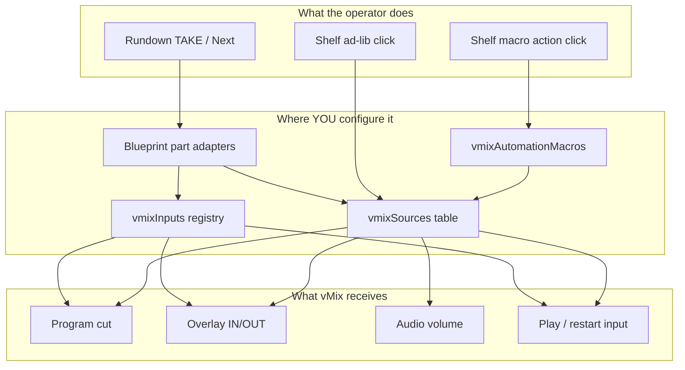

# Where vMix input selection is configured

This is the **single reference** for answering: *“If I want this vMix input to fire from a rundown part, the timeline, or the shelf — where do I set it?”*

Sofie does not have one global “input assignment” screen. Input selection is split across **studio config tables**, **rundown part fields**, and **blueprint code** that connects them. This guide maps every path.

---

## Start here: three ways playout picks a vMix input



| Trigger | Operator action | You configure in | vMix command |
|---------|-----------------|------------------|--------------|
| **Rundown part** | TAKE / Next on a part | Studio config + rundown fields (see below) | Timeline objects on TSR layers |
| **Shelf ad-lib** | Click “Cut: CAM 2”, “Overlay IN: Headline”, etc. | `vmixSources` | Program / preview / overlay / play |
| **Macro action** | Click “SPRAVY Head Start”, “Studio TV ON”, … | `vmixAutomationMacros` (+ `vmixSources` keys in steps) | Multi-step sequence |

**Important:** Rundown Editor does **not** have a per-part “pick vMix input number” dropdown. Operators set **part type** and **piece fields** (`camNo`, clip file name, graphic template). Developers map those fields to vMix inputs in studio config (or hardcoded registry keys in blueprint code).

---

## Step 0: pick your routing mode

Studio Blueprint Config → **Playout Routing** (`playoutRouting`):

| Mode | Preset example | Rundown uses | Shelf uses |
|------|----------------|--------------|------------|
| **Hybrid** | `vMix Studio (granular sources + Companion macros)` | `vmixSources` (ordinal lookup from `camNo`, etc.) + CasparCG for many graphics | `vmixSources` ad-libs + macros |
| **vMix registry** | `Hello vMix` | Fixed `vmixInputs` keys (`CAMERA`, `LOWER_THIRD`, …) hardwired in blueprint code | Minimal (registry mode skips most shelf generation) |

```text
Hybrid          →  cam part + camNo: 2  →  2nd camera in vmixSources  →  vmix_input_{n}
VmixRegistry    →  cam part             →  always vmixInputs.CAMERA    →  vmix_input_camera
```

**You cannot mix both models casually.** The `helloVmix` preset uses registry mode with empty `vmixSources`. The `vmix` preset uses Hybrid with empty `vmixInputs`. Populating both tables creates duplicate layer mappings (see [Layer mappings explained](#layer-mappings-explained)).

For **Správy / news production** you will almost certainly need **Hybrid** (`vmix` preset) plus **new blueprint work** so VT/príspevok parts route to the correct per-clip vMix inputs (not implemented yet — see [Správy news from a rundown](#správy-news-from-a-rundown-what-works-vs-whats-missing)).

---

## Master table: “I want X” → configure here

### Rundown-driven (TAKE / Next)

| I want… | Operator sets (Rundown Editor) | Developer sets (Studio Blueprint Config) | Blueprint code path |
|---------|--------------------------------|------------------------------------------|---------------------|
| Program camera | Part type `cam`, piece `camNo` (e.g. `1`, `2`) | **Hybrid:** `vmixSources` — list cameras in order; camNo picks Nth camera entry | `part-adapters/camera.ts` |
| Program camera | Part type `cam` | **Registry:** `vmixInputs.CAMERA.input` = vMix input name/number | `camera.ts` → always `CAMERA` key (**camNo ignored**) |
| Remote guest | Part type `remote`, remote index | **Hybrid:** `vmixSources` remote entries in order | `part-adapters/remote.ts` |
| Double-box / DVE | Part type `dve`, box assignments | **Hybrid:** `vmixSources` per-box cams + one `multiview` entry for layout input | `part-adapters/dve.ts` |
| Double-box | Part type `dve` | **Registry:** `vmixInputs.DOUBLEBOX` | `dve.ts` → always `DOUBLEBOX` (**box cams ignored**) |
| Play a clip (VT / full) | Part type `full` or `vt`, `fileName` | **Hybrid:** first `mediaplayer` in `vmixSources` + CasparCG plays the file | `part-adapters/vt.ts` |
| Play a clip | Part type `full` or `vt` | **Registry:** `vmixInputs.BG_LOOP` — **fileName ignored**, loops BG_LOOP input | `vt.ts` |
| Lower third text | Gfx piece template name contains `l3d` | **Registry:** `vmixInputs.LOWER_THIRD` + overlay channel | `helpers/graphics.ts` → `helloVmixTimeline.ts` |
| Headline / strap / ticker | Gfx template name contains `head`, `strap`, `ticker` | **Registry:** matching `vmixInputs.*` key | `graphics.ts` |
| Lower third / gfx (Hybrid) | Gfx template + fields | CasparCG HTML templates (not vMix Title inputs unless you use shelf) | `graphics.ts` → CasparCG layers |
| Hello part types | Part type string `CAMERA`, `LOWER THIRD`, `CLIP`, … | `vmixInputs` keys per [Hello vMix](../hello_vmix.md) | `part-adapters/helloVmix.ts` |
| Script only | Script piece | — | No vMix change |

### Operator shelf (manual, outside rundown flow)

| I want… | Operator action | Developer sets | Generated from |
|---------|-----------------|----------------|----------------|
| Cut to a specific input | Shelf → “Cut: {label}” | `vmixSources.{key}.input` | `rundown/globalVmixAdlibs.ts` |
| Preview an input | Shelf → “Preview: {label}” | same | `globalVmixAdlibs.ts` |
| Overlay on/off | Shelf → “Overlay IN/OUT: {label}” | `vmixSources.{key}.overlayChannel` or `type: graphics` | `globalVmixAdlibs.ts` |
| Play / restart media | Shelf → “Play / Restart: {label}” | `vmixSources` mediaplayer / video category | `globalVmixAdlibs.ts` |
| Quick camera (legacy) | Shelf → “Camera 1” | `vmixSources` or `atemSources` cameras in order | `rundown/globalAdlibs.ts` |
| REC / STREAM / EXTERNAL | Shelf toggles | Device mappings (always present) | `globalVmixAdlibs.ts` |

### Macro actions (Companion-style sequences)

| I want… | Operator action | Developer sets | Code |
|---------|-----------------|----------------|------|
| Multi-step automation | Shelf → macro label | `vmixAutomationMacros.{macroKey}` with `steps[]` | `executeActions/vmixAutomation.ts` |
| Step targets an input | — | `sourceKey` → key in `vmixSources`, or explicit `input` number | `helpers/vmixSources.ts` |

Macro external IDs: `vmixMacro:{macroKey}` (for Device Triggers / Companion → Sofie).

---

## Rundown Editor → blueprint: field reference

When you build a rundown in **Rundown Editor** (or Spreadsheet Gateway), these fields affect vMix routing:

| Part type | Piece / field | Effect in Hybrid mode | Effect in registry mode |
|-----------|---------------|----------------------|-------------------------|
| `cam` | `camNo` on camera piece | Nth `type: camera` in `vmixSources` | Ignored → `CAMERA` registry |
| `remote` | remote index on piece | Nth `type: remote` in `vmixSources` | Same (no registry branch) |
| `dve` | per-box `camNo` / remote / video | Each box → `vmixSources` lookup; program → multiview input | Ignored → `DOUBLEBOX` registry |
| `full`, `vt` | `fileName` | CasparCG plays file; program cut to first mediaplayer | Ignored → `BG_LOOP` playback |
| `vo` | `fileName` | Same pattern as VT | Same as VT |
| `gfx` | template `clipName` | CasparCG template (or registry overlay if name matches `l3d`/`head`/…) | Registry overlay + SetText if key exists |
| `titles` | — | CasparCG opener + mediaplayer cut | No registry-specific path |

Parser entry: `sofie-editor-parsers/index.ts` → `part-adapters/index.ts`.

**There is no rundown field for:** registry key name, `vmixSources` key, macro name, or arbitrary vMix input number. Those are developer-level bindings.

---

## Studio config tables (Sofie UI locations)

All under **Settings → Studio → Blueprint Config** (after uploading blueprints):

| UI section | Config key | Purpose |
|------------|------------|---------|
| Playout → Playout Routing | `playoutRouting` | `Hybrid` vs `VmixRegistry` |
| Inputs → vMix Sources | `vmixSources` | Named inputs for shelf + Hybrid rundown resolution |
| Inputs → vMix Input Registry | `vmixInputs` | Named inputs for registry rundown routing |
| Automations → vMix Automation Macros | `vmixAutomationMacros` | Multi-step shelf actions |
| Vision Mixer Device | `visionMixer` | Host, port, `deviceId` (`vmix0`) |

Show-style config does **not** contain vMix input mappings in the demo blueprints — everything is studio-wide.

---

## Layer mappings explained

**Layer mappings** (shown on the blueprint config page) are not where you *assign* inputs. They are the **TSR address book** auto-generated from your studio config:

| Layer name pattern | Created from | vMix meaning |
|--------------------|--------------|--------------|
| `vmix_me_program`, `vmix_me_preview` | Always | Mix 1 program / preview |
| `vmix_overlay_graphics` … `_4` | Always | Overlay buses 1–4 |
| `vmix_input_{n}`, `vmix_audio_{n}` | Each `vmixSources` entry | Input number *n* |
| `vmix_input_{registry_key}` | Each `vmixInputs` entry | Named registry input |
| `vmix_overlay_{registry_key}` | `vmixInputs` with `overlay` set | Named overlay |
| `vmix_mix{N}_program` | `vmixInputs` with `mix: N` | Additional mix bus |
| `casparcg_*`, `sisyfos_*` | CasparCG / Sisyfos device config | Non-vMix devices |

Blueprints write **timeline objects** to these layer names; TSR translates them to device commands. You edit the **source tables** (`vmixSources` / `vmixInputs`), not the mapping list directly.

Duplicate-looking rows (e.g. `vmix_input_1` and `vmix_input_fqqqmrgohawrkkaie`) mean both `vmixSources` and `vmixInputs` point at the same physical input — usually after a Companion import onto a Hybrid preset.

---

## Správy news from a rundown: what works vs what’s missing

### What works today

| Workflow piece | How |
|----------------|-----|
| Fixed-layout smoke test | `helloVmix` preset + standard part types → one camera, one DVE, overlays, BG loop |
| Manual Správy-style sequences | `vmix` preset macros (e.g. cut → wait → overlay stinger) on shelf |
| Per-input operator control | `vmix` preset shelf ad-libs from `vmixSources` |
| Import Companion buttons → macros | [Companion import tool](./companion-import-tool.md) |

### What does **not** work yet for full news-from-rundown

These are the gaps behind “I still can’t recreate the news from a rundown”:

| Správy need | Current behavior | What’s needed |
|-------------|------------------|---------------|
| **Príspevok** clip → correct vMix LIST input | VT/full uses one shared mediaplayer (`BG_LOOP` or first mediaplayer) | Part adapter: map `fileName` or rundown metadata → per-príspevok `vmixSources` key or input number |
| **ILU** vs **SYN** audio (quiet bed vs full video audio) | No part-level audio profiles | ILU/SYN logic in VT/DVE adapters or dedicated part types + `audioVolume` on timeline |
| **Ruch** (low bed under ILU) | Only via macro `audioVolume` steps | Same as above — part-driven or show-style audio rules |
| Gfx from rundown → vMix Title (headline box, stinger) | Hybrid gfx → CasparCG; vMix overlays only via shelf or registry keys | Wire gfx pieces to `vmixSources` graphics entries + `overlayChannel` |
| Camera choice in registry mode | Always `CAMERA` | Use Hybrid + `vmixSources`, or extend registry adapter to read `camNo` |
| Sheet “load z riadka” / AddInput | Not in blueprints | Rundown ingest for paths + optional `httpGet` macro or external loader |
| Preset switch (Gabi/Miso) | Macro `httpGet` OpenPreset only | Rundown part type or macro — not automatic from rundown structure |

### Practical operating model **until** blueprint work lands

```text
Rundown (Rundown Editor)     →  structure, scripts, timing, gfx text fields
Studio vmixSources           →  which vMix input each named key is
Shelf ad-libs + macros       →  actual ILU/SYN cuts, stingers, audio, resets
```

That is a **hybrid manual show**: the rundown drives the story order; operators (or Device Triggers) hit shelf items for vMix execution. It is not yet a single-button “play the whole newscast” from rundown alone.

### Recommended path to full rundown-driven Správy

1. **Preset:** `vMix Studio (granular sources + Companion macros)` with `playoutRouting: Hybrid`.
2. **Import** Companion backup → populate `vmixSources` + `vmixAutomationMacros` ([import tool](./companion-import-tool.md)).
3. **Map every on-air input** you need as a `vmixSources` entry (cameras, ILU player, SYN player, headline box, stinger, per-príspevok inputs).
4. **Rundown:** build parts (`cam`, `dve`, `full`, `gfx`) with correct `camNo` / `fileName` / templates.
5. **Blueprint extensions** (development work): VT adapter resolves clip → príspevok input; gfx adapter can target vMix overlays; ILU/SYN audio in part adapters.

See [Companion migration](./companion-migration.md) and [Správy notes in the import tool](./companion-import-tool.md#správy-production-workflow-sk).

---

## Preset cheat sheet

| Preset | Routing | Rundown input selection | Shelf |
|--------|---------|-------------------------|-------|
| `demo` | Hybrid | ATEM-oriented (not vMix) | ATEM ad-libs |
| `helloVmix` | VmixRegistry | Fixed registry keys in code | Minimal |
| `vmix` | Hybrid | `vmixSources` ordinal + CasparCG gfx | Full `vmixSources` ad-libs + macros |

---

## Related docs

- [Hello vMix](../hello_vmix.md) — registry mode smoke test
- [Granular sources](./granular-sources.md) — `vmixSources` shelf generation
- [Companion migration](./companion-migration.md) — Companion → Sofie translation
- [Companion import tool](./companion-import-tool.md) — bulk generate config from backup
